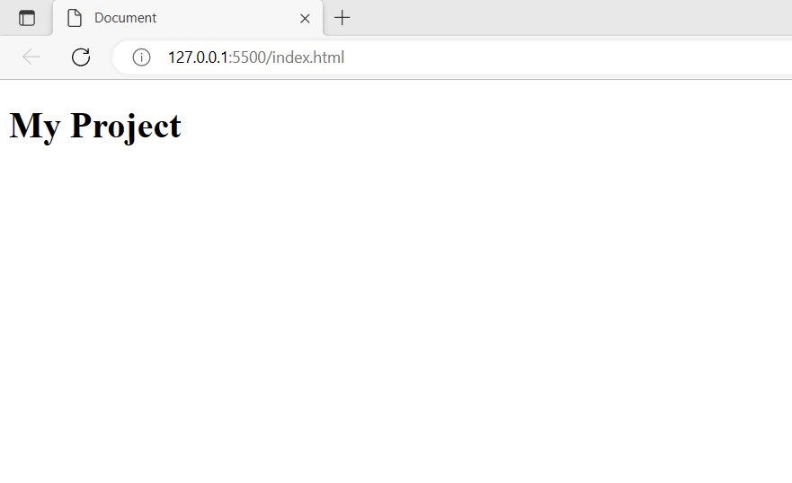

3.Deploy a static website using the same repo and add screen shot.

4.Difference between static and dynamic website.

5.Steps you followed to connect github repo to your local repo

3. 
4. Static website:- A static website has fixed content Static websites are build of HTML, CSS, and JavaScript. Dynammic website:- Dynamic Website is a website containing data that can be changeable. It uses backend and changes accordingly Like a static website, it also contains HTML data. 
5. add ssh keys then add remote link through git commands.