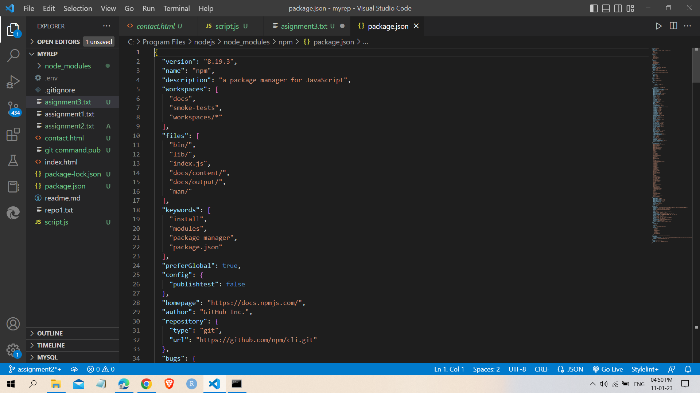
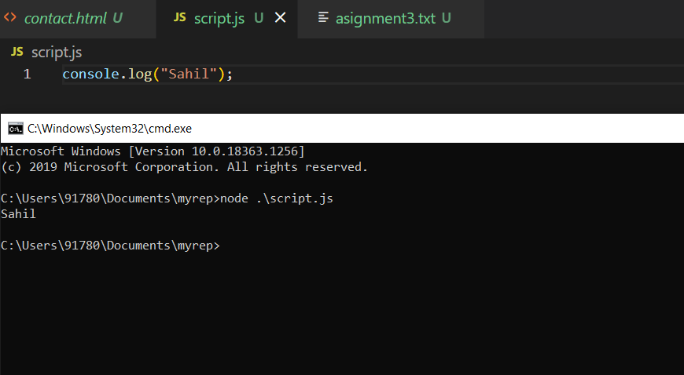

1. create a new branch in your git repo names as assignment2(paste the command)
2. tell the difference between nodejs and javascript
3. install a package using npm use it(show screen shot of package.json)
4. git command to reset a commit
5. write a simple program in javascript and run it using nodejs.

Amswer:-
1 git branch assignment2
2 javascript :- Javascript is a programming language that is used for writing scripts on the website. 
  nodejs :- NodeJS is a Javascript runtime environment.
3 
4 git revert HEAD
5 